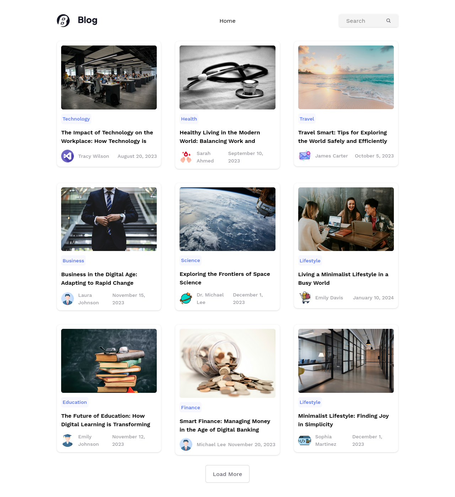
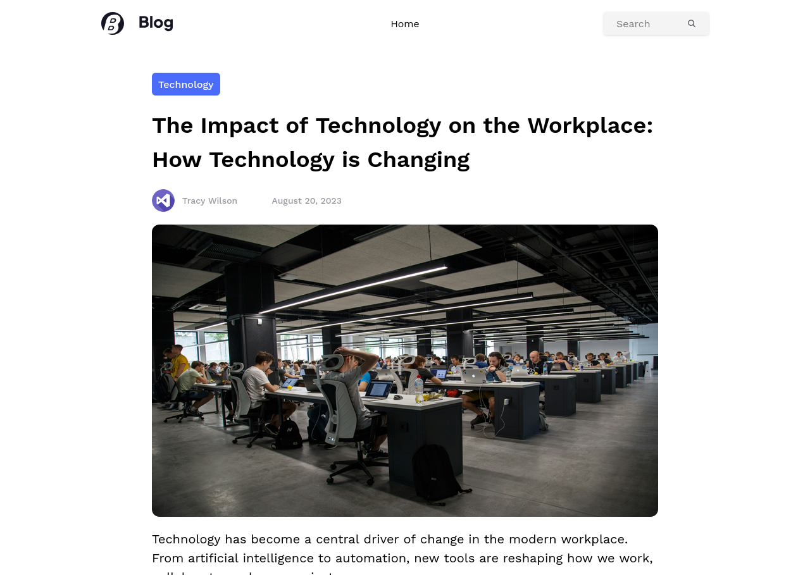
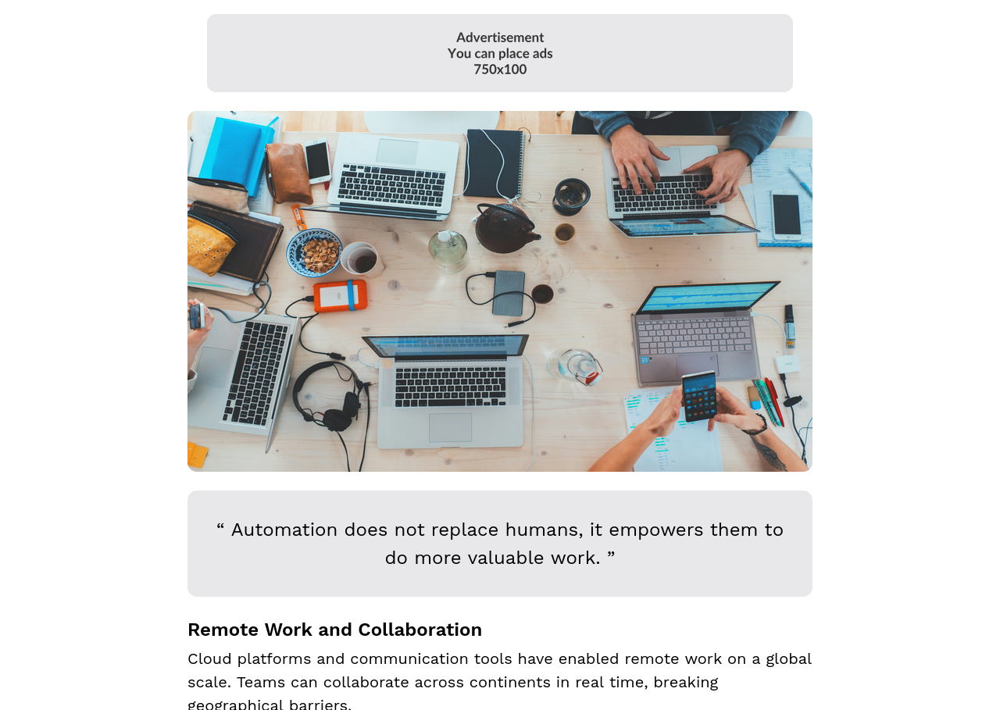
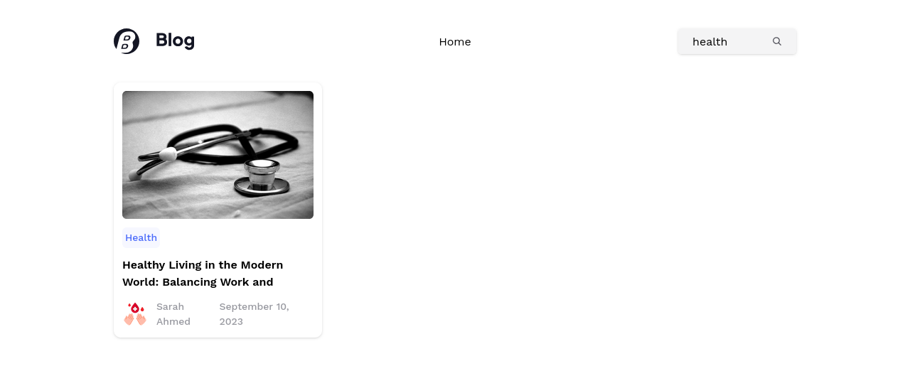
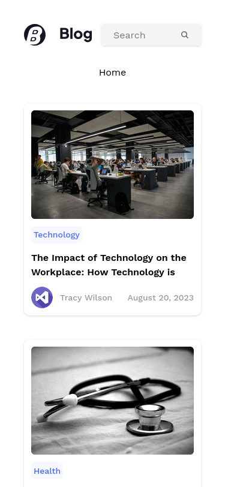

# React Blog Application (TypeScript)

A modern, responsive blog application built with **React + TypeScript**, **React Router**, and **Tailwind CSS**.  
This app displays a collection of articles with rich content (paragraphs, headings, images, quotes, and ads) and supports **search, filtering, and dynamic loading**.

## Features

- Display articles with images, headings, paragraphs, quotes, and ads.
- Responsive grid layout for desktop, tablet, and mobile screens.
- Search and filter articles by title, category, or content.
- Load more articles dynamically.
- Skeleton loading for better UX.
- Article detail page with rich content rendering.

---

## Tech Stack

- **React + TypeScript**
- **React Router DOM** (v6+)
- **Tailwind CSS**

---

## Screenshots

